# Niriko

**追番 · 收藏 · 统计** —— 一个以 Bangumi 为主数据源的 Android 原生应用。

> 仓库：<https://github.com/perchA5uka/Niriko> · 许可：MIT · 问题反馈：<https://github.com/perchA5uka/Niriko/issues>

管理动画 / 书籍 / 游戏 / 音乐 / 三次元的收藏与进度，查看放送日历与统计可视化，发现当下热门作品，并把 Steam、Bilibili、Kazumi 等平台的收藏导入进来。支持主题包、壁纸、玻璃质感界面与 WebDAV / Bangumi 双向同步。

| 项目信息 | 值 |
| --- | --- |
| 应用名 / 包名 | Niriko · `com.otakup.niriko` |
| 版本 | 1.0.0（versionCode 1） |
| SDK | minSdk 26 · targetSdk 34 · compileSdk 37 |
| 技术栈 | Kotlin + Jetpack Compose + Material 3 · 单 Activity |
| 本地存储 | Room（18 张表，v29） + DataStore Preferences |
| 单元测试 | 436 个（纯 JVM，无需设备） |
| 开源许可 | MIT（见 `LICENSE`；第三方组件见 `THIRD-PARTY-NOTICES.md`） |

---

## 目录

- [截图](#截图)
- [功能总览](#功能总览)
- [数据源与整合](#数据源与整合)
- [收藏模型](#收藏模型)
- [导入与同步](#导入与同步)
- [主题与个性化](#主题与个性化)
- [技术栈与架构](#技术栈与架构)
- [数据模型与迁移](#数据模型与迁移)
- [刷新与缓存](#刷新与缓存)
- [构建与运行](#构建与运行)
- [目录结构](#目录结构)
- [开发约定](#开发约定)
- [设计文档](#设计文档)
- [数据来源与声明](#数据来源与声明)
- [已知限制与后续计划](#已知限制与后续计划)

---

## 截图

> 以下截图取自 Android 设备实机运行。完整分辨率原图不随仓库分发，README 使用的是 600px 宽的压缩版本。

### 作品库

| 列表视图 | 观看状态编辑 |
| --- | --- |
| 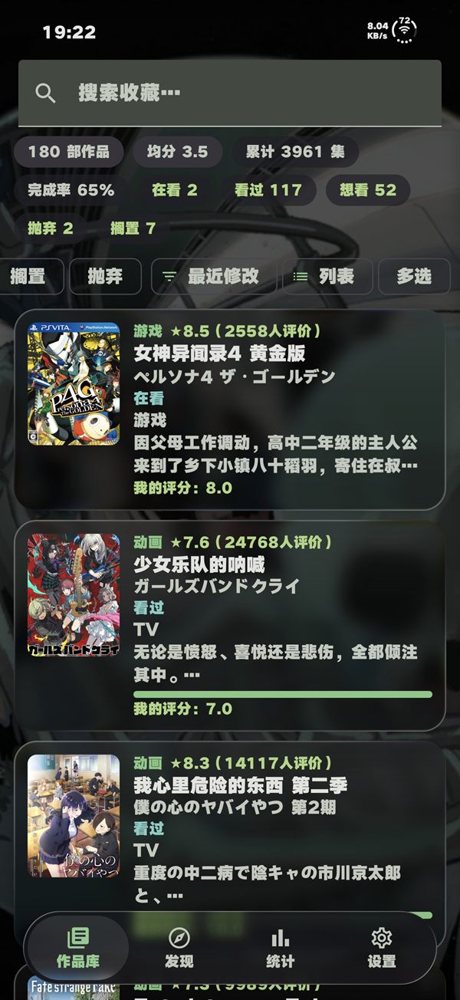 | 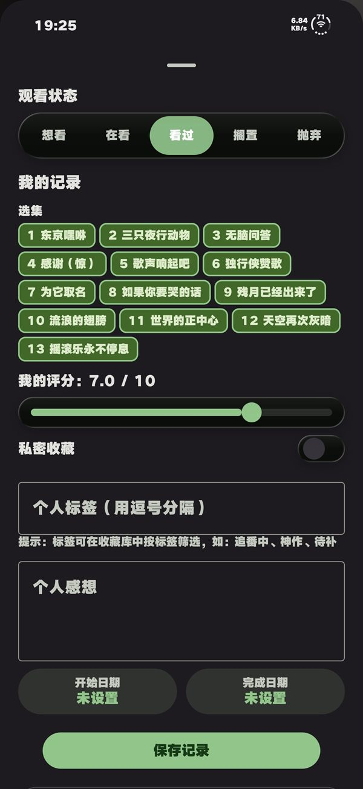 |

### 发现

| 当季热门 | 历史排名 | Steam 热销榜 |
| --- | --- | --- |
| 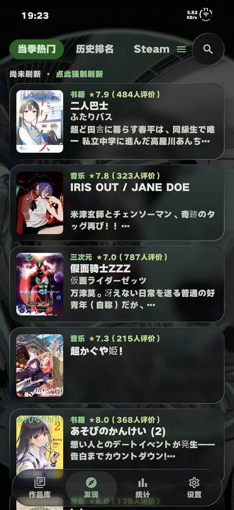 | 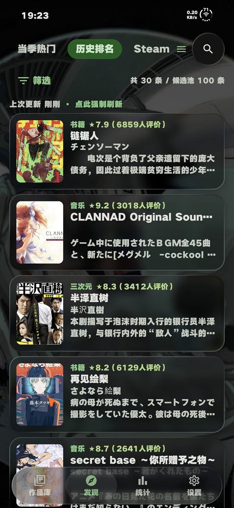 | 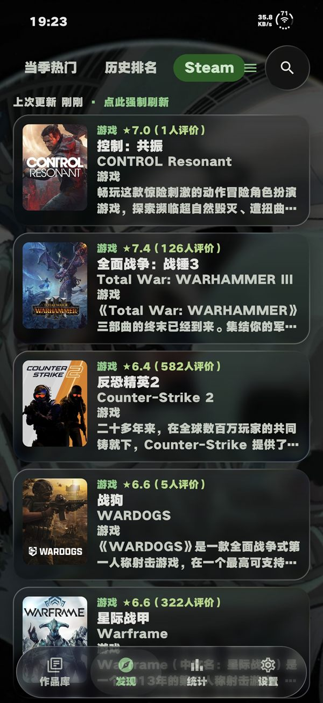 |

### 作品详情

| 封面与简介 | 简介原文与 infobox | 外部绑定 / 关联条目 / 取景地标 |
| --- | --- | --- |
| 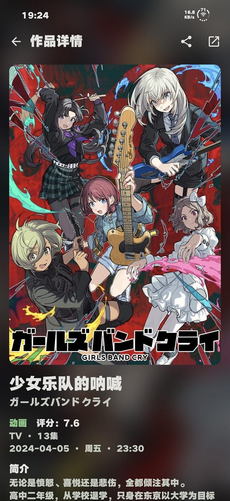 | 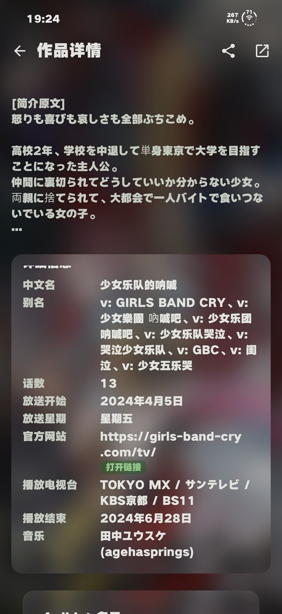 | 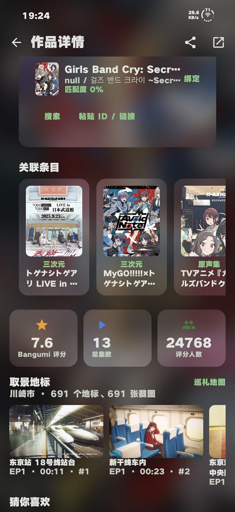 |

| 评分对比与评分分布 | 角色、制作人员与标签 | 剧照与剧集评分曲线 |
| --- | --- | --- |
| 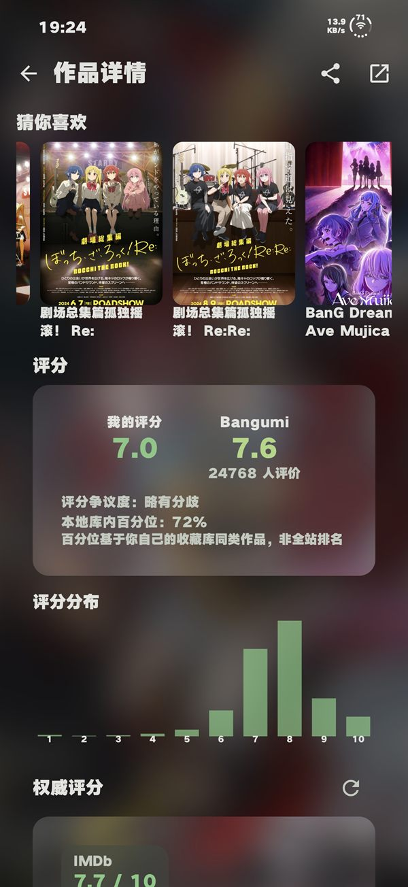 | 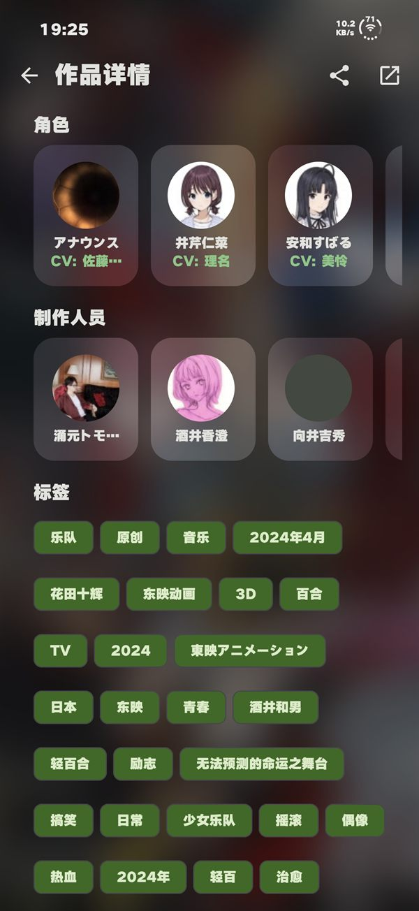 | 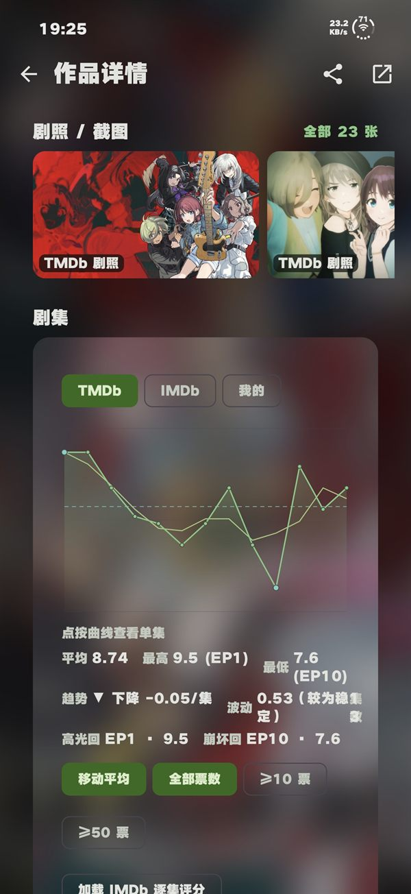 |

| 剧集列表与外部源绑定 |
| --- |
| 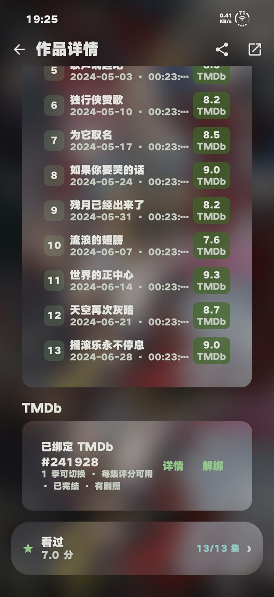 |

### 统计

| 作品日历与时间线 | 收藏概览与状态分布 |
| --- | --- |
| 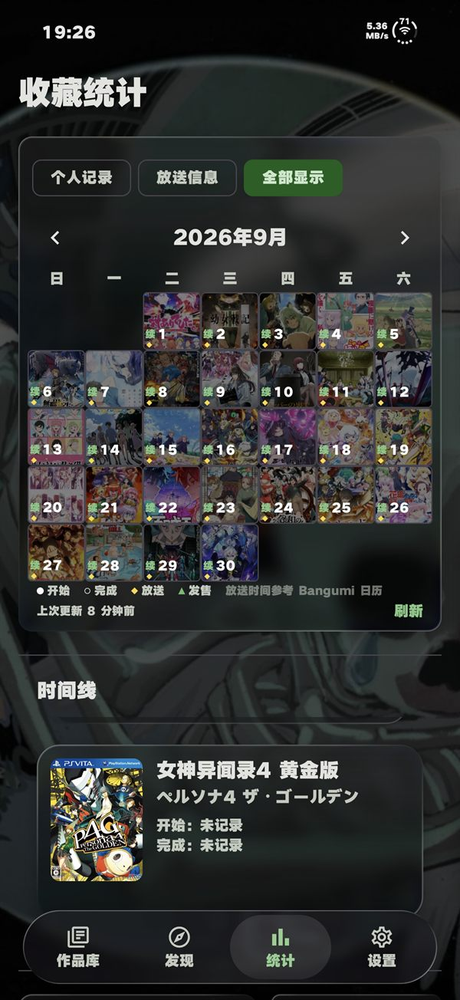 | 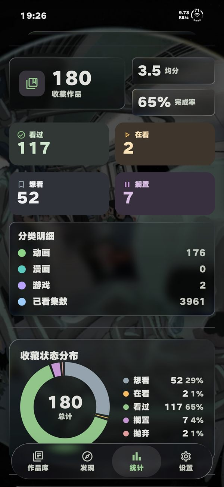 |

| 评分分布与年度总结 | 照片墙 |
| --- | --- |
| 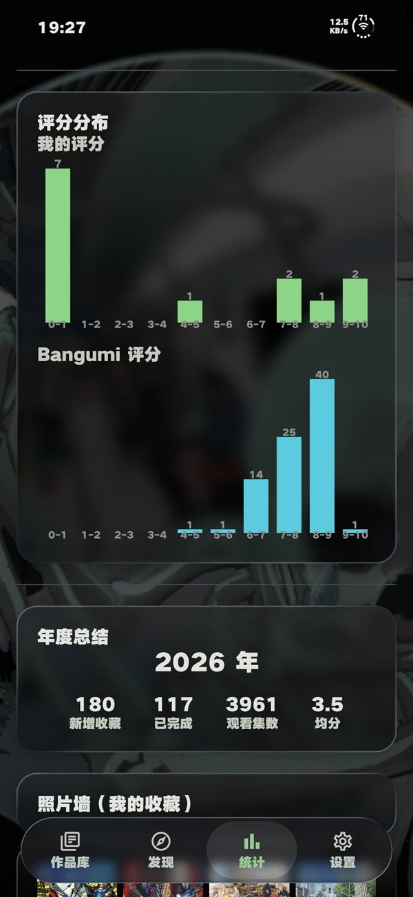 | 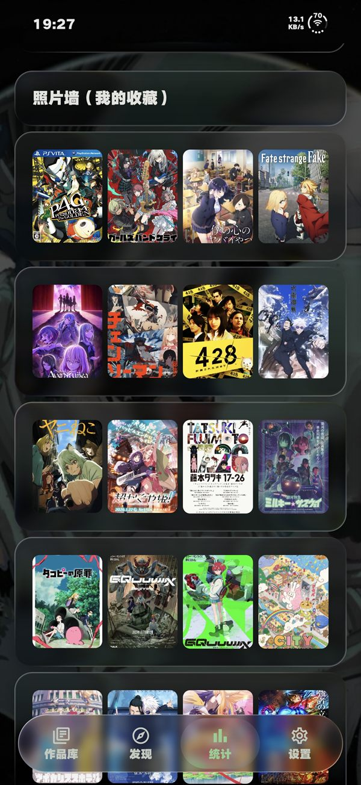 |

### 设置

| 设置（分类导航） |
| --- |
| 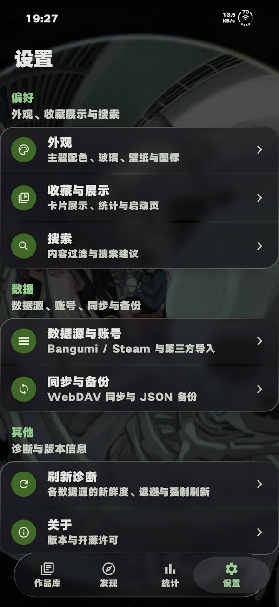 |

---

## 功能总览

底部导航四个顶级页面，用 `HorizontalPager` 承载（左右滑动切换，胶囊玻璃底栏跟手联动）。

### 作品库

本地收藏的管理中心。

- **三种视图**：海报网格 / 画廊大卡 / 列表，一键切换并记忆
- **排序**：最近修改 / 添加时间 / 评分最高 / 标题 / 观看进度
- **筛选**：观看状态（想看 / 在看 / 看过 / 搁置 / 抛弃）、个人标签、关键词搜索
- **卡片展示**：可开关状态标签与集数进度条（设置页控制）
- **批量操作**：多选后批量改状态 / 删除；长按卡片快速改状态
- **收藏的人物**：横向分区，收藏声优 / 作者 / 制作人并在人物详情页查看参与作品
- **空态引导**：无收藏时提供「开始探索」进入漫搜

### 发现

两种布局：**卡片视图**（顶栏三个入口 + 全屏列表）与 **宫格视图**（菜单宫格 + 本季横向预览），右上角一键切换并持久化。

顶栏类型行（搜索菜单内）覆盖 **全部 / 动画 / 书籍 / 游戏 / 音乐 / 三次元**，它同时驱动发现页列表与关键词搜索。

**① 当季热门** —— 展示「当下有人气」的作品，而不是「本季上线清单」：

- 候选池 = Bangumi 每日放送 `/calendar`（权威在播） ∪ 放宽到 400 天的开播日窗口检索（覆盖播一年的长连载，如特摄）
- 选取：类内热度序 → 评分人数门槛（≥100）→ **类型多样性重排**（窗口内同类 ≤3、连续同类 ≤2、小类保底 3）→ 取前 30
- **零填充**：候选不足就是不足，不用历史排名凑数；列表为空时给「查看历史排名 ›」出口

**② 历史排名** —— 榜单 + 一套完整的筛选器（对齐 Bangumi 网页版「找条目」的筛选能力）：

| 维度 | 选项 |
| --- | --- |
| 地区 | 日本 / 中国 |
| 版本 | TV / 剧场版 / OVA / WEB |
| 年份 | 当前年往前 40 年，含「2000 以前」 |
| 季度 | 1 / 4 / 7 / 10 月 |
| 状态 | 连载 / 完结 / 未播放（按开播日推算，界面有标注） |
| 类型 | 46 个高频内容标签，多选为「且」 |
| 制作 | 动画公司（按标签匹配，含中 / 日 / 英别名展开） |
| 排序 | 排名 / 上映时间 / 评分人数 / 评分 / 随机 / 名称 |
| 收藏 | 隐藏已收藏 |
| 增强 | 评分区间 / 评分人数区间 / 排名区间 / 包含 R18 |

**改动即查询**（无需点「应用」），支持触底分页。类型选「全部」时使用统一发现排序：各类型取候选 → 质量门槛 → 多样性重排 → 前 30。

**③ Steam** —— 商店热销榜前 100（`topsellers`），条目自动尝试匹配 Bangumi 词条，已收藏的显示收藏态；本地已导入的游戏不会混进榜单。

完整搜索页（发现页搜索入口与作品库空态的「漫搜」）支持：Bangumi 语法（`tag:异世界`、`sort:rank`）、拼音子串（`juren` → 进击的巨人）、NSFW（登录后走 v0，未登录走旧版接口兜底）、历史记录、人物搜索，以及**搜索建议**（本地前缀 / 拼音即时命中 + 远程聚合）。搜索空态提供「诊断搜索链路」，可一键查看榜单 / 检索 / 旧版兜底三条通路的 HTTP 状态与返回条数。

### 统计

- **作品日历**（置顶）：个人记录 / 放送信息 / 全部显示三种模式；放送条目按精确时刻落格，跨月正确归类
- **时间线**：iOS Smart Stack 风格卡片堆叠，按作品聚合的操作记录（默认折叠）
- **收藏概览**：作品数 / 均分 / 完成率等胶囊指标
- **收藏状态分布**、**作品类型分布**、**收藏月度趋势**、**评分分布**
- **评分对比**：个人评分 vs Bangumi 评分
- **年度总结**：当前年与历年数据
- **照片墙**：我的收藏封面马赛克
- **标签词云**：按个人标签使用频率映射字号，点击可筛选

### 设置

分类导航（图标 + 一句话说明），点进独立二级页：

| 分类 | 内容 |
| --- | --- |
| 外观 | 主题模式（跟随系统 / 浅色 / 深色）、动态取色、自定义主题色、OLED 纯黑、玻璃效果强度、卡片玻璃、壁纸（全局与每页）、壁纸柔化与氛围、桌面图标、分享卡包含项、减少动态效果、主题包 |
| 收藏与展示 | 默认排序、收藏卡片状态标签、进度条、年度总结开关、启动页 |
| 搜索 | 允许 R18 内容、显示搜索建议 |
| 数据源与账号 | Bangumi 端点（官方 / 国内反代）、Bangumi OAuth 登录、NSFW 检索状态、Steam API Key 与账号游戏库、权威评分源密钥（TMDb / OMDb / IGDB / RAWG / Discogs / OpenCritic）、豆瓣剧照与灰通道、Kazumi / 哔哩哔哩导入入口 |
| 同步与备份 | WebDAV 同步（含自动同步与冲突优先级）、JSON 全量备份导出 / 恢复、Bangumi 收藏同步 |
| 刷新诊断 | 各数据源新鲜度、失败次数、退避剩余与最近错误；强制刷新 / 清除刷新记录 |
| 关于 | 版本、开源许可、反馈入口 |

### 二级页面

| 页面 | 路由 | 说明 |
| --- | --- | --- |
| 作品详情 | `subject_detail/{id}` | 见下 |
| 单集详情 | `episode_detail/{subjectId}/{epId}` | 剧照、我的评分（0–10）、我的评价（停止输入自动保存）、该集权威评分、本集简介、上一集 / 下一集、看到这里、二刷标记、Bangumi 章节页外链 |
| 人物详情 | `person_detail/{id}` | 基本信息（性别 / 生日 / 血型 / infobox）、参与职位统计、收藏数与评论数、配音角色与参与作品 |
| 角色详情 | `character_detail/{id}` | 基本信息、出演作品、收藏数与评论数、Bangumi 角色页外链 |
| 制作人员列表 | `staff_list/{subjectId}` | 该作品全部 staff |
| 漫搜 | `subject_search` | 沉浸式搜索页（含趋势区） |
| 哔哩哔哩导入 | `bilibili_sync` | 登录 B 站 → 拉取追番与评分 → 匹配 → 勾选导入 |
| Steam 游戏库 | `steam_sync` | 登录 Steam → 拉取游戏库（含家庭共享）→ 匹配 → 勾选导入 |

**作品详情页**由横滑评分卡与多个区块组成：

- **评分横滑卡**：我的评分 · 社区评分（Bangumi / Bilibili + 评分争议度 + 本地库内同类型百分位） · 权威评分（多源对照） · 评分分布 · 榜单成绩（手动录入）
- **剧集**：集号 / 标题 / 播出日 / 时长 / 讨论数 / 每集评分角标 / 剧照缩略图 / 展开看单集简介 / 「看到这里」写回进度；附评分走势曲线
- **剧照**：TMDb 背景图 + 每集剧照 + B 站分集封面 + Anitabi 取景截图 + Steam 截图（豆瓣为可选灰通道），统一进全屏查看器
- **角色 / 制作人员 / 关联作品**：横滑卡片，可跳转
- **猜你喜欢**：按本地标签共现 + 同类型评分的纯本地推荐（前 10）
- **圣地巡礼**：Anitabi 取景地标（缩略图 + `EP{集} mm:ss · #N`）+ 巡礼地图外链（仅动画、非 NSFW）
- **外部信息源区块**：Steam（价格 / 当前在线 / 开发商 / 发行商 / Metacritic / 标签 / 截图 / 成就进度 / 活跃排名）、VNDB（平均时长 / 贝叶斯评分 / 原语与语言 / 平台 / 权重标签 / 截图 / relations）、AniList（原名 / 评分 / 状态 / 格式 / 标签）、TMDb（网络 / 制作公司 / 状态 / 单集时长 / 多语言海报 / 逐集评分入口）、权威评分（多源对照 + 手动录入成绩）
- **操作**：分享卡、更换封面（TMDb 多语言海报 / 当前源 / 相册）
- **外链门户**：一键跳转到 23 个外部平台 —— Bilibili / Bangumi App / Steam / VNDB / AniList / 网易云音乐 / QQ 音乐 / Mihon / IMDb / TMDb / MyAnimeList / AniDB / 豆瓣 / Fami通 / Metacritic / OpenCritic / Billboard / Oricon / MusicBrainz / Discogs / RateYourMusic / Goodreads / 批评空间。统一走「精确 scheme → 搜索 scheme → 网页」三级降级；对当前作品无可用动作的目标会自动隐藏

### 跨页面能力

- **封面共享元素过渡**：列表卡封面 → 详情页缩放飞入
- **Liquid Glass**：纯 Compose 实现的悬浮胶囊底栏与玻璃卡片，底栏真实折射壁纸（按设置分级降级：全效果 / 降低 / 关闭）
- **入场动画**：滚动进入视口才播放并错峰；系统「关闭动画」或设置「减少动态效果」时跳过
- **离线可用**：搜索结果与详情自动落库；远程失败时回退本地缓存（并在界面标注为离线结果）
- **全屏图片查看器**：翻页 + 捏合缩放 + 双指平移 + 双击缩放 + 保存到相册 + 浏览器打开原图
- **分享卡**：把作品或收藏渲染成海报卡（可含评分 / 进度 / 个人标签）后调用系统分享
- **放送提醒**：对「在看」条目按放送时间推送通知（WorkManager 周期任务，开机自动恢复）

---

## 数据源与整合

Niriko 以 Bangumi 为主体，其他源按能力补充；Bangumi 无词条时，外部源可以成为与 Bangumi 作品同等的一等条目。

### Bangumi（主数据源）

- `/calendar` 每日放送、`/v0/subjects` 浏览与榜单、`/v0/search/subjects` 条件检索、详情 / 剧集 / 角色 / 人物 / 关联
- **OAuth 登录**：应用内完成授权（用户在 Bangumi 自建应用，不内置公共应用 id）；登录后 NSFW 检索走 v0，未登录时走旧版接口兜底
- **端点可切换**：官方 `api.bgm.tv` 或国内反代，切换即时生效（含图片域重写）
- 内置每季放送静态数据 `assets/data/onair/*.json`，为本地作品补齐精确放送时刻

### AniList（兜底 + 补充）

无需密钥、国内可直连。用于动画 / 漫画的补充信息与**独立条目兜底**（`sourceKey="anilist:media-{id}"`）；绑定关系存 `anilist_bindings`，不限制作品类型。标题匹配只产出候选，由用户确认后才写库。

### Steam（游戏商业数据 + 游戏库导入）

作为 GAME 的补充源：价格、当前在线人数、开发商 / 发行商、Metacritic、标签、截图、成就进度、活跃玩家排名（Top 100）。

- 公开接口（`storesearch` / `appdetails` / `GetNumberOfCurrentPlayers` / `GetMostPlayedGames`）无需密钥；`GetOwnedGames` 与成就接口需 API Key
- **游戏库导入**：OpenID 2.0 登录或手动填 SteamID64 → 拉取本人库 + 家庭共享库 → 匹配 Bangumi → 勾选导入；游玩时长推断状态（玩过 → 在看，未玩 → 想看）
- Steam 独占条目：Bangumi 无词条的游戏以 `sourceKey="steam:{appid}"` 落库，打开详情页会自动重新尝试匹配 Bangumi（命中即升级为正式词条）

### VNDB（视觉小说）

作为 GAME（视觉小说）的补充源与兜底源：平均游玩时长、贝叶斯评分与票数、popularity、原语与支持语言、平台、按权重排序的标签、截图、relations（前作 / 续作 / 同世界观 / 外传 / 同系列 / 另一版本 / 共用角色 / 同人 / 原作）。走 VNDB REST API v2，无需密钥。

### 权威评分源

统一 `RatingSource` 注册表（与游戏数据源同构：注册序即优先级、按作品类型派发、未配置密钥的源自动隐藏、单源失败不影响其它源）：

| 作品类型 | 接入源 |
| --- | --- |
| 动画 / 三次元 | TMDb（主）、OMDb / IMDb（可选，逐集需显式触发） |
| 游戏 | Steam 好评率（无需密钥）、Metacritic（Steam 字段）、IGDB、RAWG、OpenCritic |
| 音乐 | MusicBrainz（含社区评分，无需密钥）、Discogs |
| 书籍 | Google Books、Open Library |
| 视觉小说 | VNDB（并入统一评分卡） |

支持「原生分 + 10 分制换算」并存展示（避免跨源误读），并提供「全部票数 / ≥10 票 / ≥50 票」的票数门槛筛选。

### Anitabi（圣地巡礼）

动画条目详情页的「取景地标」：`api.anitabi.cn/bangumi/{id}/lite`，D7 快照缓存，仅动画且非 NSFW 触发，附巡礼地图外链。

### 豆瓣（灰通道，默认关闭）

用于补充剧照。三条链路（rexxar JSON → frodo JSON → HTML 剧照页）依次尝试，请求头（UA / Cookie / Referer）可在设置中修改，失败静默降级不影响其它剧照来源。设置页提供**连通性自检**：逐端点显示 HTTP 状态码、耗时、最终 URL、Content-Type 与响应前 400 字节。

> 豆瓣未授权第三方抓取，该通道默认关闭、仅供个人查看；若需分发建议移除。

### 统一匹配服务

外部源绑定（VNDB / AniList / TMDb / 豆瓣）共用一套四层匹配：

1. **infobox 明确 ID**（置信度 1.0，命中后不再发查询）
2. **多查询串**：中文名 → 原名 → infobox 别名 → ASCII 变体；高置信命中即停止
3. **多字段打分**：标题相似度 × 年份（冲突 ≥3 年扣分）+ 集数 + 平台，输出匹配理由
4. **手动兜底**：关键词搜索（不过滤低分候选）+ 粘贴 ID / 链接

写库策略偏保守：VNDB / AniList / TMDb / 豆瓣只产出候选，由用户确认；Steam 由 appid 精确标识，允许自动绑定。

---

## 收藏模型

- **状态**：想看 / 在看 / 看过 / 搁置 / 抛弃；动词按类型显示——动画·三次元「看」、书籍·漫画「读」、游戏「玩」、音乐「听」
- **进度**：动画 / 三次元按集；书籍 / 漫画支持**卷进度**；游戏记录游玩时长（存储为分钟，界面显示小时）
- **评分与评价**：0–10 分与短评；支持标记**二刷**
- **个人标签**：用于作品库筛选与统计页标签词云
- **私密收藏**：本地可见，导出与 WebDAV 同步会排除
- **单集数据**：每集的我的评分 / 评价 / 二刷，独立于作品级评分

---

## 导入与同步

| 功能 | 说明 |
| --- | --- |
| **JSON 全量备份** | 导出 / 恢复收藏、作品元数据、手工条目、搜索历史、人物收藏、外部绑定、封面覆盖、单集评价、手动成绩等 |
| **WebDAV 同步** | 先下载并按 LWW（最后写入胜出）合并到本地，再把合并结果发布回远端；手动与自动同步串行化互斥；失败进入退避梯并在设置页显示「上次同步 / 下次可重试时间」 |
| **自动同步** | 回到前台触发，节流 15 分钟；可在设置页开关 |
| **Bangumi 收藏同步** | 应用内 OAuth 登录后可把本地收藏同步到 Bangumi 账号（可设冲突优先级：本地优先 / 远端优先），支持自动同步 |
| **Kazumi 导入** | 读取 Kazumi 导出的 `collectibles.hive`，预览后勾选导入（仅动画，默认跳过已存在） |
| **哔哩哔哩导入** | WebView 内登录 B 站，注入脚本拉取追番列表、用户评分与短评，按 season_id / 标题匹配后勾选导入（默认不覆盖已有评分） |
| **Steam 游戏库导入** | 见「数据源与整合 · Steam」 |

---

## 主题与个性化

### 自定义主题色

任意种子色 → 完整 M3 配色（HCT TONAL_SPOT 配方）；提供 HSV 取色面板（色相条 + 饱和度 / 明度面板）、HEX 输入与精选快捷色板，实时预览。优先级：Material You 动态取色 > 自定义种子色 > 默认品牌绿。

### 壁纸

四个顶级页背景，支持全局一张 + 每页覆盖；静态图（Coil）与动态视频（Media3 ExoPlayer 循环静音，退后台或进二级页暂停解码）。可调高斯柔化强度与氛围（浓郁 / 均衡 / 素净）。壁纸层与悬浮底栏共用 backdrop 捕获层，胶囊底栏因此能真实折射壁纸。

### 主题包（`.nirikotheme`）

ZIP 包：`theme.json`（必需）+ 可选壁纸文件 + 每页覆盖，包体上限 50MB。可通过应用内选择器或系统「打开方式」导入（已注册文件关联），也可把当前配色与壁纸导出分享。导入时校验 zip 炸弹 / 路径穿越 / JSON 合法性。

### 桌面图标

Android 平台限制下启动器图标只能来自 APK 预置资源，因此采用标准方案：主题色或上传图片生成 Bitmap → 固定快捷方式（ShortcutManager）→ 隐藏本体图标（禁用 activity-alias）。

实现要点：

- **确认后才隐藏**：只有确认桌面确实已存在该快捷方式，才会隐藏本体图标；无法确认时保留原图标并给出原因
- **旧版广播兜底**：官方钉入接口不可用时，补发旧版 `INSTALL_SHORTCUT` 广播（MIUI / HyperOS 系需先在系统里允许「桌面快捷方式」权限）
- **自动恢复**：快捷方式缺失时，回到前台自动恢复本体图标，避免应用从桌面「消失」
- **手动隐藏需确认**：桌面没有任何 Niriko 快捷方式时，隐藏前会明确提示只能从系统设置进入应用

### 动画体系

弹簧规范（入场 damping 0.85 / 按压 0.75），公共组件 `RevealOnScroll` 让列表项进入视口才播放并错峰；「减少动态效果」开关或系统动画关闭时自动跳过。

---

## 技术栈与架构

| 层 | 选型 |
| --- | --- |
| UI | Jetpack Compose + Material 3（Compose BOM）、Navigation Compose、Material Icons Extended |
| 架构 | 单 Activity + `HorizontalPager` 四个顶级页 + NavHost 承载二级页；ViewModel 手写 Factory（**无 DI 框架**）；Repository 层；统计 / 趋势 / 发现等纯函数计算器（可单测） |
| 本地存储 | Room（KSP，18 张表）+ DataStore Preferences（设置）+ 应用私有文件（主题包 / 上传的图标） |
| 网络 | Retrofit + OkHttp + Kotlin Serialization；数据源以插件链注册（Bangumi 主源 + AniList 兜底 + Steam / VNDB / 游戏源旁路） |
| 图片 | Coil Compose（显示尺寸感知解码） |
| 主题 | material-color-utilities（HCT 配色）、Media3（动态壁纸）、core-splashscreen |
| 后台 | WorkManager（放送提醒） |
| 玻璃 | miuix-blur 0.9.0 + kyant backdrop（配合自实现的折射 / 模糊，按设置等级降级） |
| 搜索 | pinyin4j（拼音键与子串命中） |
| 测试 | JUnit4（纯 JVM 单测） |

依赖集中声明在 `gradle/libs.versions.toml`，应用模块在 `app/build.gradle.kts`。

---

## 数据模型与迁移

Room 数据库 `NirikoDatabase`：**version 29**，迁移链 `v2 → v29`，全部为 `ALTER TABLE ADD COLUMN` / `CREATE TABLE`，不改列类型、不删列。

18 张表分三类：

- **核心**：`work_items`、`subjects`、`collections`、`search_history`、`person_collections`
- **外部数据源扩展**（不污染核心作品模型）：`steam_games`、`steam_bindings`、`steam_library_items`、`vndb_bindings`、`anilist_bindings`、`bilibili_sync_items`、`subject_external_ids`、`subject_external_ratings`、`anitabi_points`
- **剧集与用户数据**：`episodes`、`episode_ratings`、`episode_my_ratings`、`manual_awards`

**条目身份**：`subjects.sourceKey` 是跨数据源稳定唯一键（`steam:570` / `anilist:media-123` / `vndb:v123` …），Bangumi 条目为 `null`；旧版负数占位条目会在启动时幂等迁移。

`app/schemas/` 由 Room 导出，**需要随仓库提交**（迁移校验依赖它）。

---

## 刷新与缓存

所有「要不要刷新 / 刷新几次 / 失败了怎么办」由一处裁决（`data/refresh/RefreshCoordinator`）：

- **新鲜度**：每个资源有软 / 硬 TTL（趋势、放送日历、季节、剧集、Steam、Anitabi 各不相同；作品详情软 TTL = 0，保持「进页面即出缓存 + 后台刷新」的体感）；状态持久化，冷启动不会全量重跑
- **去重**：同 key 并发请求合并为一次（下拉、重试、切类型、进前台可能同时触发）
- **串行**：WebDAV 的「读远端 → 合并 → 写远端」串行化，手动与自动同步互斥
- **退避**：失败后 30s / 60s / 120s / 300s 不再自动重试；用户主动下拉或重试可绕过 TTL 与退避
- **写放大治理**：所有 `subjects` 落库走写入网关，单事务批量 + 内容 diff 写；重复刷新同一份数据是零写入
- **生命周期**：进前台触发一轮受控刷新，退后台取消轻量前台任务
- **可观测**：设置 →「刷新诊断」列出各资源新鲜度、累计失败、退避剩余与最近错误，并提供强制刷新与清除记录；发现页与统计页显示「上次更新 X 分钟前」，点按即强制刷新

---

## 构建与运行

### 环境要求

- Android Studio Hedgehog 或更新版本
- JDK 17+（推荐使用 Android Studio 自带 JBR；如需显式指定，请在环境变量 `JAVA_HOME` 或**本机** `~/.gradle/gradle.properties` 中设置 `org.gradle.java.home`，不要写进仓库——那会把构建绑死在某台机器上）
- Android SDK 34+（compileSdk 37）

### 常用命令

```bash
# 调试包（产物：app/build/outputs/apk/debug/app-debug.apk）
.\gradlew.bat assembleDebug

# 单元测试（纯 JVM，无需设备 / 模拟器）
.\gradlew.bat testDebugUnitTest

# 发布包
.\gradlew.bat assembleRelease
```

用 Android Studio 直接打开本目录、等待 Gradle Sync 完成后点运行也可以。

---

## 目录结构

```
app/src/main/java/com/otakup/niriko/
├── data/
│   ├── local/          # Room 数据库、DAO、实体（迁移链 v2→v29）
│   ├── remote/         # Bangumi / AniList / Steam / VNDB / TMDb / 豆瓣 / Anitabi / Bilibili 客户端与 DTO
│   ├── repository/     # 收藏 / 作品 / Steam / VNDB / AniList / Anitabi 等仓库
│   ├── discover/       # 发现页统一排序（DiscoveryFeed）与「找条目」筛选模型（BrowseFilter）
│   ├── seasonal/       # 当季热门：候选池、在播判定、人气选取
│   ├── calculator/     # 统计、趋势、评分洞察、每集对齐等纯函数
│   ├── match/          # 统一外部匹配服务（四层）
│   ├── refresh/        # 刷新编排（新鲜度 / 去重 / 串行 / 退避）
│   ├── probe/          # 灰通道连通性探针
│   ├── onair/          # 内置放送静态数据
│   ├── themepack/      # .nirikotheme 主题包
│   ├── notification/   # 放送提醒调度与 Worker
│   └── filter/ · search/ · settings/ · sync/ · backup/
├── plugin/             # 数据源插件链与导入器（Kazumi / Bilibili）
├── navigation/         # 底部导航、Pager、NavHost
├── ui/                 # 各页面与通用组件（玻璃卡片、封面、搜索栏、图片查看器、分享卡…）
├── viewmodel/          # ViewModel 与手写 Factory
└── util/               # 标题解析、封面 URL、放送状态、拼音、异步工具等

app/src/main/assets/data/        # 放送静态数据（onair/*.json）与 B 站站点映射
app/schemas/                     # Room 导出的 schema
docs/                            # 设计与调研文档
```

---

## 开发约定

- **无 DI 框架**：依赖在 `NirikoApplication` 集中装配，ViewModel 通过手写 Factory 接收
- **纯函数优先**：统计 / 排序 / 匹配 / 在播判定等逻辑抽成不依赖 Android 的纯函数，便于单测
- **KDoc 用「」而非反引号**（本工程构建工具链对反引号处理不稳定）
- **Room 迁移的 DDL 必须与 `app/schemas` 导出的 `createSql` 逐字一致**——schema 校验只在真机首次开库时执行，编译期不会报错
- **新增逻辑请补 JVM 单测**：当前 436 个用例覆盖统计、趋势、发现排序、筛选映射、匹配打分、刷新策略、解析器等
- 引入新第三方依赖前先讨论，优先使用平台 API 与已有库实现

---

## 设计文档

`docs/` 保留了各阶段的设计、方案与调研记录，可作为实现细节的补充阅读：

| 文档 | 主题 |
| --- | --- |
| `docs/bangumi-reference-plan.md` | 以 Bangumi 客户端为参照的功能规划 |
| `docs/anishelf-reference-plan.md` | 以 AniShelf 为参照的功能规划 |
| `docs/portal-feature-plan.md` | 外链门户 / 传送门设计 |
| `docs/refresh-architecture-plan.md` | 刷新编排架构（新鲜度 / 去重 / 退避 / 写放大） |
| `docs/rating-data-sources-research.md` | 各评分源的 API、限流与覆盖度实测 |
| `docs/authoritative-ratings-detail-parity-plan.md` | 权威评分与详情页对齐方案 |
| `docs/aggressive-data-and-episode-page-plan.md` | 剧集数据与单集页方案 |
| `docs/ui-redesign-plan.md` · `docs/liquid-glass-card-upgrade-plan.md` · `docs/dock-kyant-migration-plan.md` | UI / 玻璃质感改造 |
| `docs/performance-audit.md` | 性能审计 |
| `docs/remaining-phases.md` | 后续阶段清单 |
| `docs/fix-and-redesign-plan-round{3,4,5,6}.md` | 各轮问题定位与解决方案（含验收与踩坑记录） |
| `docs/ios-port/` | iOS / KMP 移植可行性调研（spike、依赖映射、模块划分等） |

---

## 数据来源与声明

- 作品元数据来自 **Bangumi 番组计划**（`api.bgm.tv`），版权归 Bangumi 及各权利方所有；本应用仅作个人收藏管理用途
- **AniList** 用于补充与兜底；**VNDB** 用于视觉小说信息；**Anitabi** 提供取景地标数据
- **Steam** 相关数据来自 Steam 商店与 Web API，版权归 Valve 及各发行商所有
- 本应用使用 **TMDb API**，但未获得 TMDb 的认可或认证（This product uses the TMDb API but is not endorsed or certified by TMDb）
- **OMDb** 内容按 CC BY-NC 4.0 提供，**不可用于商业用途**
- **豆瓣** 通道是默认关闭的灰色通道；豆瓣未授权第三方抓取，仅供个人查看使用。代码内置了一个社区公开的 frodo apikey（非豆瓣官方发布、可能随时失效）；若要分发衍生版本，请自行评估并替换或移除该通道
- 本仓库以 **MIT License** 开源（见 `LICENSE`）；随应用分发的第三方依赖、内嵌源码与数据来源的许可声明见 `THIRD-PARTY-NOTICES.md`

---

## 已知限制与后续计划

### 功能限制

- 历史排名筛选器中的**评分区间 / 评分人数区间**目前是「候选池内本地过滤」，不是服务端全量过滤（检索通路暂未暴露这两个参数）；其余维度均为服务端过滤
- 历史排名的筛选面板是内联可折叠面板（默认收起），不是弹出式 sheet
- VNDB / AniList / TMDb / 豆瓣的绑定不会自动写库（只产候选，避免错绑）；仅 Steam 由 appid 精确匹配后自动绑定
- 角色的声优（CV）列表：Bangumi 没有「按角色查声优」的端点，角色详情页不展示 CV（人物页的「配音角色」不受影响）
- TMDb 多季作品按年份 + 集数自动挑季，暂未提供手动指定季号
- 豆瓣「防剧透翻页」参数已就绪但未启用

### 工程待办

- WebDAV 同步尚未纳入 `subject_external_ids`、`episode_my_ratings`、`manual_awards`、封面覆盖等新增数据（JSON 备份已包含）
- 按源限流闸门（IGDB 4 req/s、MusicBrainz 1 req/s、VNDB 200 次 / 5 分钟）尚未实现，目前靠「高置信提前停止查询」与批量查询降低请求量
- Room 迁移测试未补（Room testing / Robolectric）
- 详情页 `ExtendedSnapshot` 未包含全部新字段，二次进详情页会重跑部分外部源详情 / 剧照候选
- 平板 / 折叠屏的自适应布局（导航栏 + 详情双栏）尚未实现
- `release` 构建未配置签名，`assembleRelease` 产出的是未签名 APK；如需分发请自备 keystore（`*.jks` / `*.keystore` 已在 `.gitignore` 中，切勿提交）
- `compileSdk = 37` 需要本机安装 Android SDK Platform 37.0，Android Studio 版本过旧时可能同步失败；另外 AGP 8.13.2 官方只测试到 compileSdk 36.1，构建会打印一条「未测试的 compile SDK」警告（属预期，不影响产物）
- 仓库未附带 CI，单元测试与构建需本地执行：`.\gradlew.bat testDebugUnitTest`
- `app/schemas` 中缺少 v25 的 schema 文件（代码里的迁移链含 24→25→26），补迁移测试时需一并补齐
